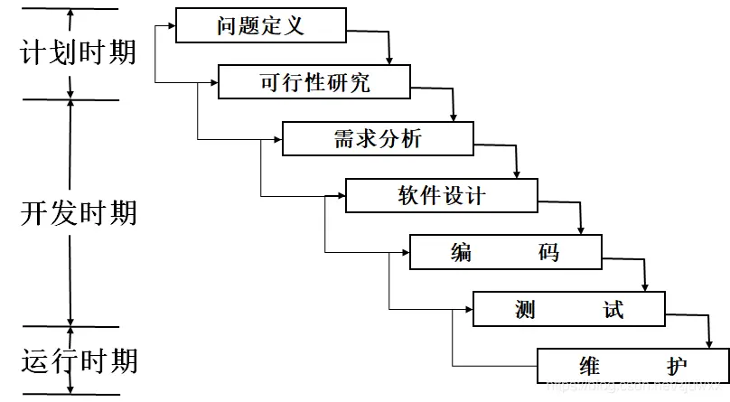
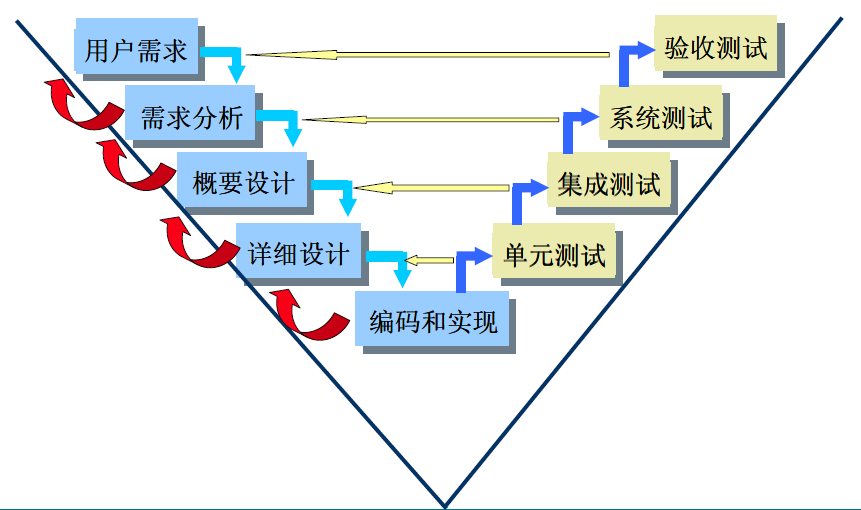
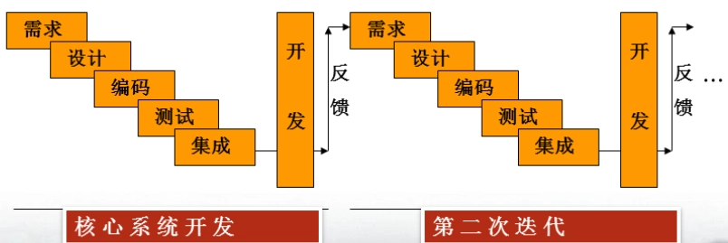
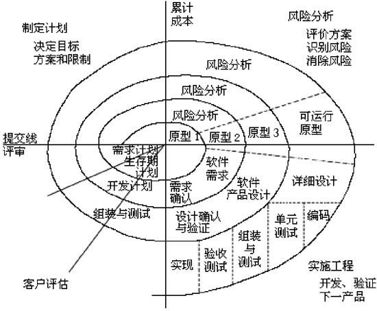
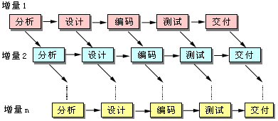
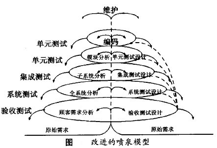
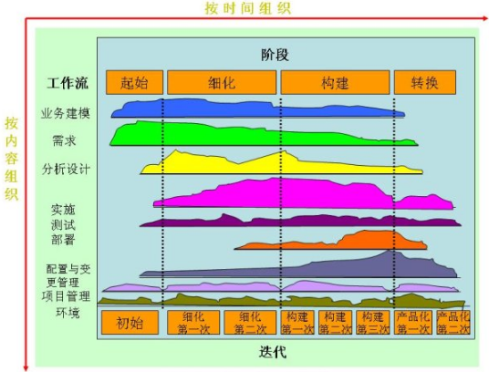
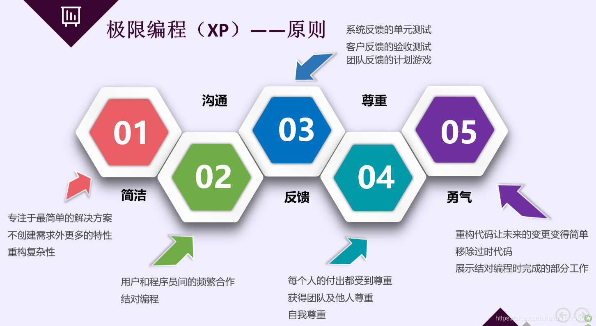

# 软件开发模型

## 瀑布模型和V模型

### 瀑布模型

* 描述：开发过程是通过设计一系列阶段顺序展开的，从系统需求分析开始直到产品发布和维护，每个阶段都会产生循环反馈，因此，如果有信息未被覆盖或者发现了问题，那么最好 “返回”上一个阶段并进行适当的修改，项目开发进程从一个阶段“流动”到下一个阶段。
* 核心思想：瀑布模型核心思想是按工序将问题化简，将功能的实现与设计分开，便于分工协作，即采用结构化的分析与设计方法将逻辑实现与物理实现分开。将软件生命周期划分为制定计划、需求分析、软件设计、程序编写、软件测试和运行维护等六个基本活动，并且规定了它们自上而下、相互衔接的固定次序，如同瀑布流水，逐级下落。
* 缺陷：缺乏灵活性，无法通过开发活动澄清本来不够明确的需求，**不适应用户需求的变化**。

<figure><figcaption>
瀑布模型
</figcaption></figure>

### V模型

* 描述：通过客户需求分析、软件需求分析、概要设计、详细设计、软件编码、单元测试、集成测试、系统测试、验收测试九个阶段，注重测试的软件开发模型
* 核心思想：研发人员和测试人员需要同时工作，在软件做需求分析的同时就会有测试用例的跟踪，这样可以尽快找出程序错误和需求偏离，从而更高效的提高程序质量，最大可能的减少成本，同时满足用户的实际软件需求
* 缺陷：V模型仅仅把测试过程作为在需求分析、系统设计及编码之后的一个阶段，忽视了测试对需求分析,系统设计的验证，需求的满足情况一直到后期的验收测试才被验证。

<figure><figcaption>
V模型
</figcaption></figure>

## 演化模型（原型模型、螺旋模型）

### 原型模型

* 描述：指模拟某种产品的原始模型，在其他产业中经常使用。软件开发中的原型是软件的一个早期可运行的版本，它反映了最终系统的重要特性。
* 核心思想：先用相对少的成本，较短的周期开发一个简单的、但可以运行的系统原型向用户演示或让用户试用，以便及早澄清并检验一些主要设计策略，在此基础上再开发实际的软件系统。
* 构建步骤：快速分析-》构造原型-》构造原型-》评价原型-》修改

### 演化模型

* 描述：通过多次迭代，逐渐形成用户满意的成果
* 核心思想：从初始的原型逐步演化成最终软件产品
* 适用场景：对软件需求缺乏准确认识的情况。

<figure><figcaption>
演化模型
</figcaption></figure>

### 螺旋模型

* 描述：是一种演化软件开发过程模型，它兼顾了快速原型的迭代的特征以及瀑布模型的系统化与严格监控。
* 核心思想：结合演化模型和瀑布模型，引入风险分析，使软件在无法排除重大风险时有机会停止，以减小损失
* 四方面活动：制定计划、风险分析、实施工程、客户评估

<figure><figcaption>
螺旋模型
</figcaption></figure>

## 增量模型

* 描述：从一组给定的需求开始，通过构造一系列可执行中间版本来实施开发活动。第一个版本纳入一部分需求，下一个版本纳入更多的需求，依此类推，直到系统完成。每个中间版本都要执行必需的过程、活动和任务。
* 核心思想：将待开发的软件系统模块化和组件化

<figure><figcaption>
增量模型
</figcaption></figure>

## 喷泉模型

* 描述：以用户需求为动力，以对象为驱动的模型，主要用于描述面向对象的软件开发过程。该模型认为软件开发过程自下而上周期的各阶段是相互迭代和无间隙的特性。
* 特点：各个阶段无界限，强调无间隙性

<figure><figcaption>
喷泉模型
</figcaption></figure>

## 统一过程（UP）

*   统一的理解：

    * 提供在开发组织中分派任务和责任的纪律化方法，确保进度和成本的前提下，高质量地满足用户需求，方法统一
    * 对所有的关键开发活动，为所有团队成员提供了使用准则、模板和工具指导，知识统一；
    * 在项目建设过程中，确保全体成员对相同基础知识有一致的理解，共享相同的知识、过程和开发软件的视图，思想和见解统一

* 三大特点：
  * 用例驱动：
    * 用例是RUP方法论中一个非常重要的概念。简单地说，一个用例就是系统的一个功能。在系统分析和系统设计中，用例被用来将一个复杂的庞大系统分割、定义成一个个小的单元，这个小的单元就是用例。然后以每个小的单元为对象进行开发。按照RUP过程模型的描述，用例贯穿整个软件开发的生命周期。在需求分析中，客户或用户对用例进行描述；系统分布和系统设计过程中，设计师对用例进行分析；开发实现过程中，开发编程人员对用例进行实现；测试过程中，测试人员对用例进行检验。
  * 以架构为中心
    * 构架设计是系统设计的一个重要组成部分。在构架设计过程中，设计师必须完成对技术和运行平台的选取、整个项目的基础框架的设计、对公共组件的设计，如审计系统、日志系统、错误处理系统、安全系统等。设计师必须对系统的可扩展性( Extensibility)、安全性(Security)、可维护性( Maintainability)、伸缩性(Scalability)、可重用性(Reusability)和运行速度(Performance)提出可行的解决方案。
  * 迭代和增量
    * RUP强调软件开发是一个迭代模型，它定义了四个阶段：**初始、细化、构建、交付**。其中每个阶段都有可能经历从需求分析、系统设计、编码测试等一系列步骤，只是侧重点不同，例如构建阶段编码和测试部分就多一些，实际上这是一个二维模型，下文继续有分析
*   五个阶段：

    * 初始阶段
    * 精化阶段
    * 构建阶段
    * 移交阶段
    * 产生阶段

    <figure><figcaption>
统一过程
</figcaption></figure>

## 敏捷方法

* 描述：是一种应对快速变化的需求的一种软件开发能力，强调快速开发和有效适应需求变化，强调程序员团队与业务专家之间的紧密协作、面对面的沟通（认为比书面的文档更有效）、频繁交付新的软件版本、紧凑而自我组织型的团队、能够很好地适应需求变化的代码编写和团队组织方法，也更注重软件开发中人的作用。
* 核心思想：是一种以人为核心、迭代、循序渐进的开发方法。

<figure><figcaption>
极限编程
</figcaption></figure>

